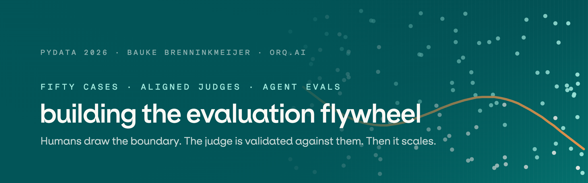
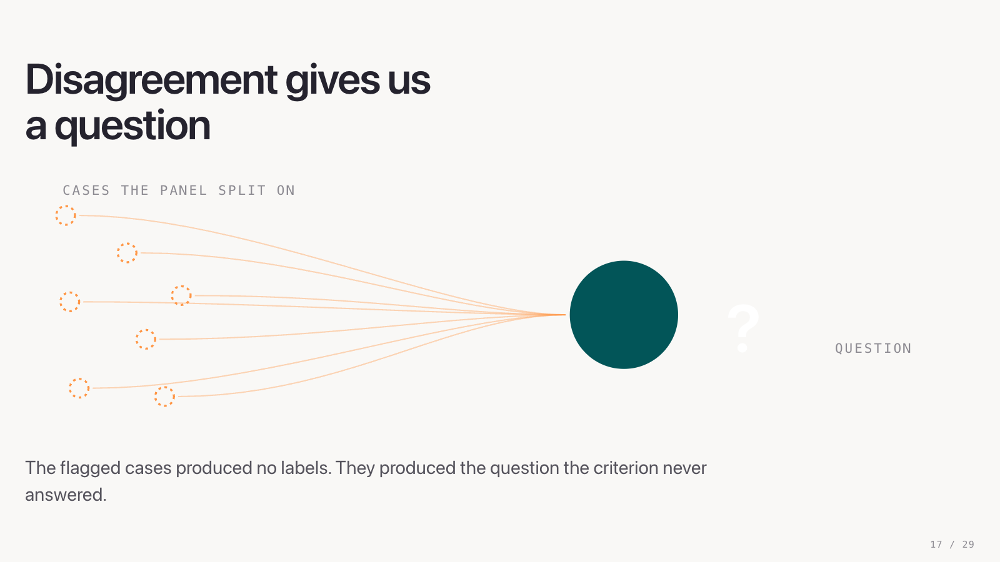

<p>
  <a href="pyproject.toml"></a>
  <a href="https://github.com/orq-ai/evaluatorq"></a>
  <a href="https://github.com/orq-ai/assistant-plugins"></a>
  <a href="abstract.md"></a>
</p>

Companion repository for the PyData 2026 talk Evaluating Agents at Scale, and the worked example
behind it: a data-analysis agent over a local DuckDB dataset, with its traces, case corpus, jury
runs and alignment artifacts.

The method runs on two installable pieces. The
[orq.ai agent skills](https://github.com/orq-ai/assistant-plugins) carry evaluation steps as
workflows a coding agent can execute, and [`evaluatorq`](https://github.com/orq-ai/evaluatorq)
([docs](https://orq-ai.github.io/evaluatorq/)) is the runner underneath them. Everything here stays
human-reviewed and versioned; nothing writes back to its own configuration.

## Start here

```bash
git clone https://github.com/Baukebrenninkmeijer/building-the-evaluation-flywheel.git
npx skills add orq-ai/assistant-plugins   # skills, in any compatible coding agent
uv add evaluatorq                         # the runner; this repo pins 1.35.0
export ORQ_API_KEY=your-key-here
```

Two skills matter for this repository, both about turning jury output into human labels.

[`.agents/skills/orq-jury-to-alignment`](.agents/skills/orq-jury-to-alignment/SKILL.md) lives here
and is the offline bridge from a finished jury run to annotation. It ranks ties and clean
abstentions first, keeps panel disagreement separate from within-judge wobble, drops mechanical
failures, adds stable controls, and calls no model and no network:

```bash
uv run scripts/prepare_jury_annotations.py \
  --cases orq/resources/datasets/simulation-cases-v4.jsonl \
  --results orq/resources/datasets/decision-support-v4/observations.jsonl \
  --jury orq/resources/datasets/decision-support-v4/jury-prompt-v3/jury-results.jsonl \
  --output-dir runs/<new-jury-annotation-run>
```

`orq-evaluator-alignment`, from the public set, then opens the resulting `queue.json` and saves
provenance-bound labels. Its single-judge rewrite and retest stages are not valid jury comparisons
and stay out of that handoff.

## What the talk argues

Reviewers label every applicable case pass or fail and write one sentence explaining why. The label
makes the boundary operational, the critique carries the nuance.


Forcing the choice does not remove ambiguity. It pushes the ambiguous cases onto one side of a line
that several reasonable reviewers would draw differently. That band is where the alignment work
happens.


A panel of judges run repeatedly over those cases does not resolve the band, and that is the point.
The cases the panel splits on produce no label. They produce the question the criterion never
answered, which a human answers once and the evaluator prompt then inherits.



For agents, the final answer is only the endpoint. A run also exposes the trajectory, the tool calls
and whether it stayed inside its instructions, so the behavior can be evaluated too.


Where that leaves the automation:

> Trust automation only inside the slice tested against humans. Stop when disagreement, drift, or
> false passes show that you have left it.

## What is in here

| Path | Contents |
|---|---|
| `src/analytics_chatbot/` | The agent: gateway client, guarded SQL tool, insight tool, run store, CLI |
| `orq/resources/` | Definitions for the hosted agent, its two local tools and its evaluators |
| `scripts/` | Case generation, simulation, jury, annotation-prep, comparison-upload and resource-sync entry points |
| `slides/` | `build_deck.py` generates the single-file deck `pydata-2026.html` |
| `abstract.md`, `outline.md` | The talk's contract and its maintained outline |
| `docs/superpowers/plans/` | The living delivery plan and task log. Start there before changing anything |
| `runs/`, `data/` | Git-ignored run artifacts and the generated DuckDB dataset |

## Setup

You need Python 3.11+, `uv`, and an orq project API key with Responses write access. The package
loads `.env` with `override=True`, so its project-scoped key beats a stale inherited shell value.

```bash
uv sync
cp .env.example .env
# Add ORQ_API_KEY and ORQ_PROJECT_ID to .env.
uv run analytics-chatbot seed-data
```

No workspace identifiers live in the tree. `orq/resources/project.yaml` declares
`project_id: ${ORQ_PROJECT_ID}` and the loader resolves it from the environment, failing loudly when
it is unset. Point it at your own orq.ai project; the rest of the definitions are portable.

## Run the agent

```bash
uv run analytics-chatbot ask "What was net revenue by region in 2025?"
uv run analytics-chatbot ask "Calculate EMEA revenue and save that insight" --show-trajectory
uv run analytics-chatbot chat
uv run analytics-chatbot show-run RUN_ID
```

Evaluation runs take stable attribution without creating high-cardinality tags:

```bash
uv run analytics-chatbot ask "What is month-over-month EMEA growth in Q3 2025?" \
  --run-kind eval --split test --case-id revenue-growth-07 \
  --identity evaluation-runner --json
```

From Python:

```python
from analytics_chatbot import AnalyticsChatbot
from analytics_chatbot.config import TraceContext

agent = AnalyticsChatbot()
result = agent.ask(
    "What was net revenue by product category in 2025?",
    conversation=agent.new_conversation(),
    context=TraceContext(run_kind="eval", evaluation_split="dev", case_id="case-01"),
)
print(result.answer, result.tool_calls)
```

## Hosted resources

Preview the reconciliation plan, then apply it explicitly:

```bash
make sync-orq
make sync-orq-apply
```

Both need the project's `ORQ_API_KEY` in `.env`. The sync checks the locked project key and id,
follows pagination, refuses duplicate resource keys and never creates a project. Applying twice is
safe: the second pass reports only no-ops. `--kinds tool`, `--kinds agent` or `--kinds evaluator`
narrows it to a reviewed subset.

The bundle holds one `analytics-decision-support-quality` jury and two Python trajectory
evaluators. The jury is reference-free, uses a three-model panel with three repetitions, and accepts
only the full ordered conversation plus final response. It is in `shadow` status with 30 human
labels: it may sync, but it is not a gate. An evaluator in `pending_human_labels` status is refused
by the sync. Read-only snapshots and dry-run plans are always allowed.

## The v4 evaluation data

Everything the talk shows is tracked under
[`orq/resources/datasets/decision-support-v4/`](orq/resources/datasets/decision-support-v4/README.md):

- 50 Sphere.com case definitions with decision context and a frozen 30 development / 20 test split
  (`simulation-cases-v4.jsonl` one level up);
- the 50 accepted observed conversations;
- three immutable 50-row jury runs, one per prompt version: the baseline rubric, the first
  human-rules revision, and prompt v3;
- 30 human development labels (27 pass, three fail) with a written explanation each. The 20 test
  cases stay sealed;
- the development-only comparison of all three prompt versions, the Experiment behind the deck's
  judge-grid slide.

The pipeline that produced them, in order. Only the first and fourth steps are free. The others call
models or upload to Orq, and the jury and upload scripts refuse to run without an approval flag:

```bash
uv run python scripts/generate_simulation_cases.py      # 50 cases with DuckDB oracles (offline)
uv run python scripts/run_simulation.py --limit 50 --output runs/<observations>.jsonl
uv run python scripts/run_decision_support_jury.py \
  --cases orq/resources/datasets/simulation-cases-v4.jsonl \
  --results runs/<observations>.jsonl --output runs/<jury>.jsonl --approve-calls
uv run scripts/prepare_jury_annotations.py ...          # review queue (offline, see above)
uv run python scripts/upload_decision_support_jury_comparison.py \
  --output runs/<receipt>.json --approve-upload
```

`generate_simulation_cases.py` regenerates the tracked corpus byte for byte; a test holds it to
that.

## Observability and safety

Every gateway request uses model `deepseek/deepseek-v4-flash`, trace name
`PyData2026-AnalyticsChatbot`, and a conversation thread tagged `pydata2026`, `analytics-chatbot` and
the run kind. Metadata carries dataset version, agent version, evaluation split, case id, interface
and run kind. Reporting aggregates by project, identity and tag; metadata is for filtering traces
rather than grouping.

Each turn also writes an ordered JSONL record under `runs/RUN_ID/`. Finished runs become
`events.jsonl`, interrupted ones keep `events.partial.jsonl`. That file joins gateway steps, tool
inputs and results, token usage, failures and insight snapshots into one evaluation record.

SQL is parsed before execution, limited to a single read-only statement, run through a read-only
DuckDB connection, capped at 200 rows and interrupted after 10 seconds. The source data is never
mutated. `save_insight` is only exposed when the user explicitly asks to save something, and it
writes inside the active run directory.

## Tests

The offline tests need no credentials and never contact Orq:

```bash
uv sync --locked --dev
uv run --no-sync ruff check .
uv run --no-sync pytest -m "not live" -q
```

Live tests are opt-in:

```bash
ANALYTICS_CHATBOT_LIVE_TEST=1 uv run pytest tests/test_live_gateway.py -m live -q
```

## The talk

[`abstract.md`](abstract.md) is what was promised to the conference and [`outline.md`](outline.md) is
the maintained 30-minute outline. Build the deck with `uv run python slides/build_deck.py` and open
`slides/pydata-2026.html`. The deck's typeface, ES Klarheit Kurrent, is licensed and not in this
repository; set `DECK_FONT_DIR` to a folder holding it to embed it, otherwise the deck uses system
fonts. The [design specification](docs/superpowers/specs/2026-09-02-analytics-chatbot-design.md)
covers component boundaries and trace semantics, and the
[flywheel diagram](docs/assets/evaluation-flywheel.svg) is available as a slide-ready SVG.

Bauke Brenninkmeijer, [LinkedIn](https://www.linkedin.com/in/bauke-brenninkmeijer-40143310b/),
[Orq.ai](https://orq.ai)

## License

[MIT](LICENSE).
