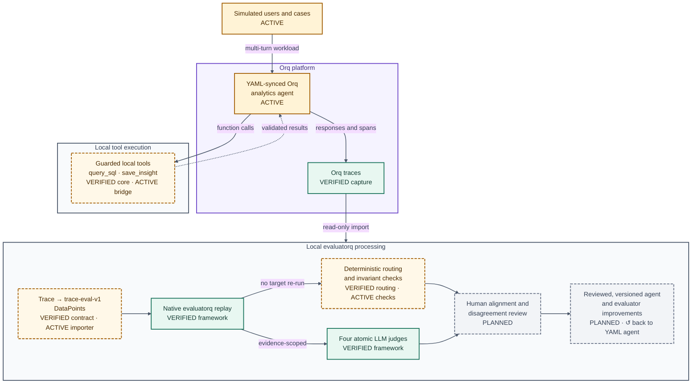

# analytics-chatbot

The operational data-analysis agent for the PyData 2026 talk, [Evaluating Agents at Scale](abstract.md).
It answers business questions against a deterministic local DuckDB dataset, calls the model through
the orq AI Gateway, and records the final response, tool trajectory, and state changes needed by a
later evaluation loop. Evaluation operations remain separate from the runtime, and improvements are
reviewed and versioned rather than applied by a self-learning loop.

## Evaluation flywheel

<!--
Source of truth for docs/assets/evaluation-flywheel.svg.
Regenerate the slide asset from this Mermaid block; do not edit the SVG diagram by hand.
-->



*Figure: the evaluation flywheel and its repository delivery status. `VERIFIED` means integrated
and checked; `ACTIVE` means work exists outside the integrated baseline; `PLANNED` means the design
is agreed but no accepted implementation exists. Mixed-status nodes name both states explicitly.*

**Text alternative:**

Simulated multi-turn workloads enter the YAML-defined analytics agent on Orq. The hosted agent calls
locally guarded query and save tools, receives their validated results, and records responses and
spans as Orq traces. A read-only local importer converts those traces into `trace-eval-v1` evaluatorq
`DataPoint`s. Native evaluatorq replay returns the recorded answer without rerunning the target, then
fans out to deterministic checks and four evidence-isolated LLM judges: answer correctness, query
semantics, evidence faithfulness, and multi-turn consistency. Human alignment and disagreement review
inform reviewed, versioned agent or evaluator changes, closing a manual—not self-learning—loop.

[Download the slide-ready SVG](docs/assets/evaluation-flywheel.svg).

## Setup

Requirements: Python 3.11+, `uv`, and an orq project API key with Responses write access.
The package loads `.env` with `python-dotenv` using `override=True`, so its project-scoped key wins
over a stale inherited shell value.

```bash
uv sync
cp .env.example .env
# Add the pydata2026 project's ORQ_API_KEY to .env.
uv run analytics-chatbot seed-data
```

Data generation uses a Polars `LazyFrame`, streams 25,000 fixed-seed orders to Parquet, then
materializes explicitly typed decimal columns in DuckDB. The generated database and manifest are
ignored by Git.

## Run it

```bash
uv run analytics-chatbot ask "What was net revenue by region in 2025?"
uv run analytics-chatbot ask \
  "Calculate EMEA revenue and save that insight" \
  --show-trajectory
uv run analytics-chatbot chat
uv run analytics-chatbot show-run RUN_ID
```

For evaluation cases, attach stable attribution without creating high-cardinality tags:

```bash
uv run analytics-chatbot ask "What is month-over-month EMEA growth in Q3 2025?" \
  --run-kind eval \
  --split test \
  --case-id revenue-growth-07 \
  --identity evaluation-runner \
  --json
```

Python usage:

```python
from analytics_chatbot import AnalyticsChatbot
from analytics_chatbot.config import TraceContext

agent = AnalyticsChatbot()
conversation = agent.new_conversation()
result = agent.ask(
    "What was net revenue by product category in 2025?",
    conversation=conversation,
    context=TraceContext(run_kind="eval", evaluation_split="dev", case_id="case-01"),
)
print(result.answer)
print(result.tool_calls)
```

## Observability and safety

Every gateway request uses model `deepseek/deepseek-v4-flash`, trace name
`PyData2026-AnalyticsChatbot`, and a stable conversation thread tagged `pydata2026`,
`analytics-chatbot`, and the bounded run kind. Identity is used for caller/evaluation-actor grouping. String metadata
contains dataset version, agent version, evaluation split, case ID, interface, and run kind. The
public reporting surface can aggregate by project, identity, and tag; arbitrary metadata is useful
for filtering traces rather than `group_by`.

Each turn also writes an exact ordered JSONL record beneath `runs/RUN_ID/`. Successful runs atomically
become `events.jsonl`; interrupted runs retain `events.partial.jsonl`. This local artifact joins the
gateway steps, tool inputs/results, token usage, failures, and insight snapshots into one evaluation
record.

SQL is parsed before execution, restricted to one read-only statement, executed through a read-only
DuckDB connection, capped at 200 rows, and interrupted after 10 seconds by default. The source data
is never mutated. `save_insight` is only exposed when the user explicitly asks to save, remember,
store, keep, or preserve a finding, and it writes only within the active run directory.

## Tests

The offline CI gate requires no Orq credentials and runs the same checks on pull requests and pushes
to `main`. Run it locally with the locked environment:

```bash
uv sync --locked --dev
uv run --no-sync ruff check .
uv run --no-sync pytest -m "not live and not simulation_live and not alignment_live" -q
uv build
```

CI also loads and validates `orq/resources` when the repository's local resource loader is present.
It never runs resource synchronization or any other command that contacts Orq. Live tests remain
explicitly opt-in:

```bash
ANALYTICS_CHATBOT_LIVE_TEST=1 uv run pytest tests/test_live_gateway.py -m live -q
```

See the [design specification](docs/superpowers/specs/2026-09-02-analytics-chatbot-design.md) for the
component boundaries and trace semantics.
