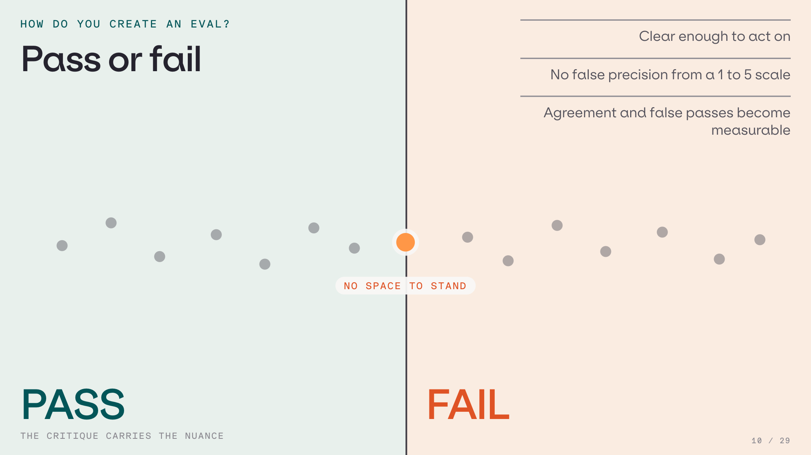
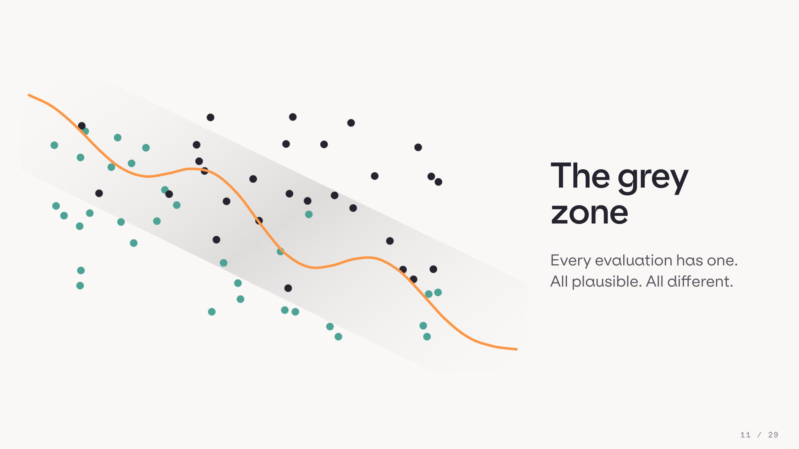
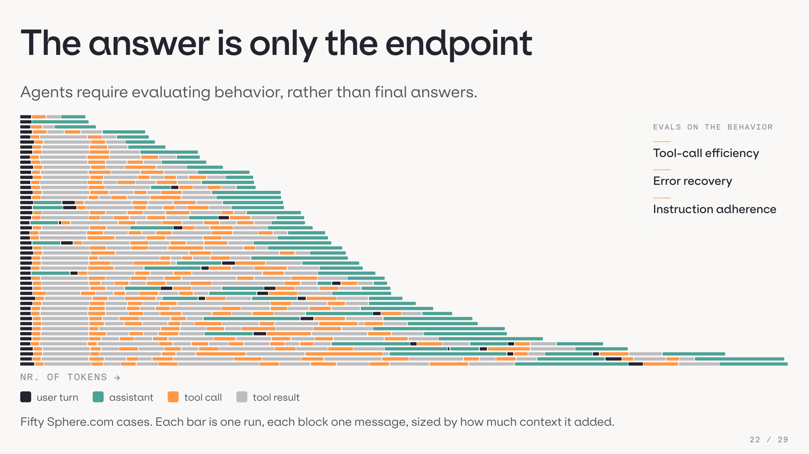

# Building the evaluation flywheel

Companion repository for the PyData 2026 talk, [Evaluating Agents at Scale](abstract.md). It holds
the method as reusable agent skills plus the `evaluatorq` runner, and the worked example the talk is
built on: a data-analysis agent over a local DuckDB dataset, with its traces, case corpus, jury runs
and alignment artifacts.

Everything stays human-reviewed and versioned. Nothing in here writes back to its own configuration.

## Start here

**1. Install the skills.** These are the [orq.ai agent skills](https://github.com/orq-ai/assistant-plugins),
in the [Agent Skills](https://agentskills.io) format, so they work in Claude Code, Cursor, Codex,
Gemini CLI and other compatible agents.

```bash
npx skills add orq-ai/assistant-plugins
export ORQ_API_KEY=your-key-here
```

In Claude Code you can install the plugin instead, which also brings MCP tools and trace hooks:

```
/plugin marketplace add orq-ai/assistant-plugins
/plugin install orq-skills@orq-claude-plugin
```

**2. Install the runner.** [`evaluatorq`](https://pypi.org/project/evaluatorq/) executes evaluations
over datapoints: deterministic checks, LLM judges, juries and multi-turn simulations. This
repository pins version 1.35.0.

```bash
pip install evaluatorq
```

**3. Pick the skill for the step you are on.**

| Where you are | Skill |
|---|---|
| Traces, but no idea what is failing | `orq-analyze-traces` builds a failure taxonomy the other skills read |
| No labelled cases yet | `orq-generate-synthetic-dataset` |
| Need a judge for one failure mode | `orq-build-evaluator` writes a binary Pass/Fail judge validated against human labels |
| Your judge disagrees with you | `orq-evaluator-alignment` finds the ambiguous cases and rewrites the prompt from your answers |
| Want the numbers side by side | `orq-run-experiment` |
| Want to fix the agent | `orq-improve-agent` |
| Need multi-turn or adversarial data | `orq-simulate-agent`, `orq-red-team` |

One skill here is not part of that public set:
[`.agents/skills/orq-jury-to-alignment`](.agents/skills/orq-jury-to-alignment/SKILL.md), the offline
bridge from a finished jury run to human annotation. It ranks ties and clean abstentions first,
keeps panel disagreement separate from within-judge wobble, drops mechanical failures, adds stable
controls, and calls no model and no network:

```bash
uv run scripts/prepare_jury_annotations.py \
  --cases orq/resources/datasets/simulation-cases-v4.jsonl \
  --results runs/<accepted-v4-observations>.jsonl \
  --jury runs/<decision-support-jury-v1>.jsonl \
  --output-dir runs/<new-jury-annotation-run>
```

The `orq-evaluator-alignment` annotation view opens the resulting `queue.json` and saves
provenance-bound labels. Its single-judge rewrite and retest stages are not valid jury comparisons
and stay out of that handoff.

## What the talk argues

Reviewers label every applicable case pass or fail and write one sentence explaining why. The label
makes the boundary operational, the critique carries the nuance.



Forcing the choice does not remove ambiguity. It pushes the ambiguous cases onto one side of a line
that several reasonable reviewers would draw differently. That band is where the alignment work
happens.



For agents, the final answer is only the endpoint. A run also exposes the trajectory, the tool calls
and whether it stayed inside its instructions, so the behavior can be evaluated too.



## What is in here

| Path | Contents |
|---|---|
| `src/analytics_chatbot/` | The agent: gateway client, guarded SQL tool, insight tool, run store, CLI |
| `orq/resources/` | Definitions for the hosted agent, its two local tools and its evaluators |
| `scripts/` | Simulation, jury, replay, annotation-prep and resource-sync entry points |
| `slides/` | `build_deck.py` generates the single-file deck `pydata-2026.html` |
| `abstract.md`, `outline.md` | The talk's contract and its maintained outline |
| `docs/superpowers/plans/` | The living delivery plan and task log. Start there before changing anything |
| `runs/`, `data/` | Git-ignored run artifacts and the generated DuckDB dataset |

## Setup

You need Python 3.11+, `uv`, and an orq project API key with Responses write access. The package
loads `.env` with `override=True`, so its project-scoped key beats a stale inherited shell value.

```bash
uv sync
cp .env.example .env
# Add ORQ_API_KEY and ORQ_PROJECT_ID to .env.
uv run analytics-chatbot seed-data
```

No workspace identifiers live in the tree. `orq/resources/project.yaml` declares
`project_id: ${ORQ_PROJECT_ID}` and the loader resolves it from the environment, failing loudly when
it is unset. Point it at your own orq.ai project; the rest of the definitions are portable.

## Run the agent

```bash
uv run analytics-chatbot ask "What was net revenue by region in 2025?"
uv run analytics-chatbot ask "Calculate EMEA revenue and save that insight" --show-trajectory
uv run analytics-chatbot chat
uv run analytics-chatbot show-run RUN_ID
```

Evaluation runs take stable attribution without creating high-cardinality tags:

```bash
uv run analytics-chatbot ask "What is month-over-month EMEA growth in Q3 2025?" \
  --run-kind eval --split test --case-id revenue-growth-07 \
  --identity evaluation-runner --json
```

From Python:

```python
from analytics_chatbot import AnalyticsChatbot
from analytics_chatbot.config import TraceContext

agent = AnalyticsChatbot()
result = agent.ask(
    "What was net revenue by product category in 2025?",
    conversation=agent.new_conversation(),
    context=TraceContext(run_kind="eval", evaluation_split="dev", case_id="case-01"),
)
print(result.answer, result.tool_calls)
```

## Hosted resources

Preview the reconciliation plan, then apply it explicitly:

```bash
make sync-orq
make sync-orq-apply
```

Both need the project's `ORQ_API_KEY` in `.env`. The sync checks the locked project key and id,
follows pagination, refuses duplicate resource keys and never creates a project. Applying twice is
safe: the second pass reports only no-ops. `--kinds tool`, `--kinds agent` or `--kinds evaluator`
narrows it to a reviewed subset.

The bundle holds one pending `analytics-decision-support-quality` jury and two Python evaluators.
The jury is reference-free, uses the approved three-model panel with three repetitions, and accepts
only the full ordered conversation plus final response. Its `pending_human_labels` status blocks
remote apply and it has zero human labels, so a hosted apply needs separate operator authorization.
Read-only snapshots and dry-run plans are always allowed.

## Current v4 review pool

The Sphere.com v4 corpus has 50 decision-context-enriched definitions with a frozen 30 development /
20 test split, and zero observations, jury results and human labels. These are not reviewed
examples, and running them needs the simulation, evaluatorq-release and paid-call approvals recorded
in the delivery plan.

## Historical v1-v3 evidence

Superseded correctness-first work, kept because the talk refers to it. This is not the current v4
path.

```bash
uv run python scripts/generate_simulation_cases.py
uv run python scripts/run_agent_smoke.py
uv run python scripts/run_simulation.py --limit 50 --max-turns 3 \
  --output runs/evaluatorq-simulation-50-20260905.jsonl

uv run python scripts/generate_simulation_cases.py --variant edge-v2   # harder multi-turn corpus
```

The one approved live edge-v2 run produced 50 unique rows: eight one-turn, 22 two-turn and 20
three-turn conversations, of which 40 reached their simulated goal. The ten behavioral failures were
kept. Do not rerun the frozen v2 corpus to replace them. Simulation outcomes are not validity gates,
and expected-tool misses are informational QC warnings.

Those observations were replayed against a pinned hosted evaluator:

```bash
uv run python scripts/run_evaluatorq_replay.py \
  --evaluator-version 1.0.0 \
  --output runs/evaluatorq-correctness-v1.0.0-20260905.jsonl \
  --datapoint-parallelism 10 --llm-parallelism 10
```

It resolves the `analytics-answer-correctness` key at runtime, verifies the version exists, rejects
`latest`, and runs all 50 stored responses with `inference=False`. The accepted baseline exported
50/50 populated scores: 47 pass and three fail. Repeating `--evaluator-version` after an approved
update creates side-by-side columns such as `answer_correctness@1.0.0` and
`answer_correctness@1.0.1` over identical rows.

One caveat as of 2026-09-05: the evaluatorq ingest route accepts the requested project path but
ignores it, so uploaded Experiments land in the workspace's Default project
([BOPS-1180](https://linear.app/orqai/issue/BOPS-1180/evaluatorq-experiments-ignore-path-always-land-in-the-default-project)).
Do not retry a run just to move it.

## Observability and safety

Every gateway request uses model `deepseek/deepseek-v4-flash`, trace name
`PyData2026-AnalyticsChatbot`, and a conversation thread tagged `pydata2026`, `analytics-chatbot` and
the run kind. Metadata carries dataset version, agent version, evaluation split, case id, interface
and run kind. Reporting aggregates by project, identity and tag; metadata is for filtering traces
rather than grouping.

Each turn also writes an ordered JSONL record under `runs/RUN_ID/`. Finished runs become
`events.jsonl`, interrupted ones keep `events.partial.jsonl`. That file joins gateway steps, tool
inputs and results, token usage, failures and insight snapshots into one evaluation record.

SQL is parsed before execution, limited to a single read-only statement, run through a read-only
DuckDB connection, capped at 200 rows and interrupted after 10 seconds. The source data is never
mutated. `save_insight` is only exposed when the user explicitly asks to save something, and it
writes inside the active run directory.

## Tests

The offline gate needs no credentials and matches CI:

```bash
uv sync --locked --dev
uv run --no-sync ruff check .
uv run --no-sync pytest -m "not live and not simulation_live and not alignment_live" -q
uv build
```

CI also validates `orq/resources` and never contacts Orq. Live tests are opt-in:

```bash
ANALYTICS_CHATBOT_LIVE_TEST=1 uv run pytest tests/test_live_gateway.py -m live -q
```

## The talk

[`abstract.md`](abstract.md) is what was promised to the conference and [`outline.md`](outline.md) is
the maintained 30-minute outline. Build the deck with `uv run python slides/build_deck.py` and open
`slides/pydata-2026.html`. The [design specification](docs/superpowers/specs/2026-09-02-analytics-chatbot-design.md)
covers component boundaries and trace semantics, and the
[flywheel diagram](docs/assets/evaluation-flywheel.svg) is available as a slide-ready SVG.

Bauke Brenninkmeijer, [LinkedIn](https://www.linkedin.com/in/bauke-brenninkmeijer-40143310b/),
[Orq.ai](https://orq.ai)
